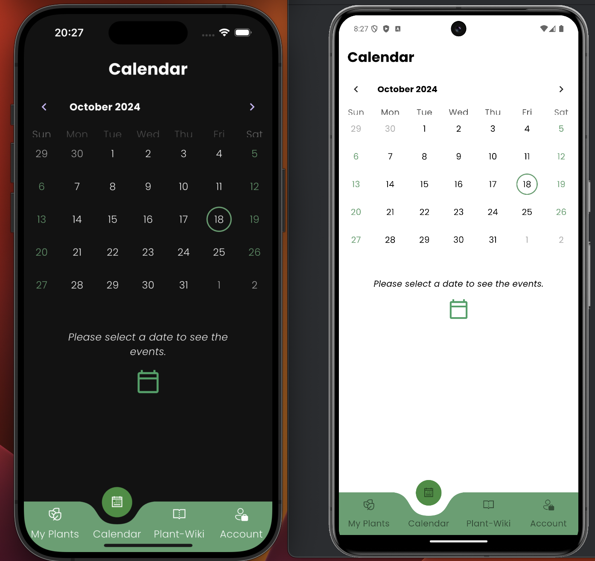

# 🌿 Plant Friends App by Group 4!

Members: Laura, Lisa, Gero, and Aylin

This repository contains a student project created for the ongoing course
on Software Engineering I using Flutter at HWR Berlin (winter term 2024).

⚠️ This code is for educational purposes only. Please do not rely on it!

## Prerequisites

To run this project locally, ensure the following are installed:

	1.	IDE of your choice (e.g., Android Studio or Visual Studio Code)
	2.	Flutter SDK (installation guide [here](https://docs.flutter.dev/get-started/install)
	3.	Git installed 
    4.  Android Emulator through Android Studio (optional, only required if not using a physical Android device)
    5.  Xcode Simulator for iOS (optional, only required if not using a physical iOS device)

## Local Development

This project uses Flutter as its framework. To build and run the app locally,
follow these steps:

    1. Clone the repository:
    `git clone https://github.com/GeroStoewe/plant_friends.git`
    `cd plant_friends`

    2. Fetch dependencies:
    `flutter pub get`

    3. Run the app:
    `flutter run`

## 📖 Abstract

Plant Friends is a Flutter-based mobile app developed to help users manage their plants
and improve plant care. The app offers a user-friendly interface where users can add,
track, and receive reminders for their plants’ watering schedules and care needs.
It aims to simplify plant care for both beginners and experienced plant enthusiasts.
Additionally, the app features a plant wiki, and plant care suggestions,
such as light and water needs tailored to each plant type. Throughout the development process,
the group gained hands-on experience with Flutter, Dart programming language, working with
state management, and backend services (i.e. Firebase).

## 📱 Features Overview

The key features of the Plant Friends app include:

| Feature                  | Description                                                                                        |
|--------------------------|----------------------------------------------------------------------------------------------------|
| 🌿 Add Plant             | Allows users to add a new plant by providing its name, scientific name, and photo                  |
| ⏰ Plant Care Reminders   | Notifies users when their plants need watering and fertilizing                                     |
| 📚 Plant Wiki            | Includes a library of popular houseplants with detailed care instructions                          |
| 📅 Watering Log          | Tracks watering history for each plant on Calendar Page                                            |
| 👤 User Profiles         | Users can create profiles and sync their plant data across devices using Firebase                  |
| 🔍 Search Plants         | Users can search their plant collection on My Plants Page and look for plants on Plant Wiki Page   |
| 🌱 Plant Quiz            | Asks questions about room conditions of user and recommends the best plants based on user answers  |
| 🌞🌚 Light and Dark Mode | Offers both light and dark themes for a better user experience                                     |

## 🏗️ Project Structure

The Plant Friends app follows a common Flutter project structure:

lib/
│── main.dart                
│── authentication/            
│── calendar/
│── fonts/
│── pages/
│── plants/
│── plantWiki/
│── profileImages/
│── quiz/
│── services/                 
│── themes/
│── widgets/

## 🛠️ Dependencies Overview

| Dependency                     | Description                                      | Why is it necessary?                                      |
|--------------------------------|--------------------------------------------------|-----------------------------------------------------------|
| 🔥 `firebase_core`             | Integrates the Firebase SDK                      | Enables cloud data storage and authentication             |
| 🔐 `firebase_auth`             | Allows user authentication                       | Enables users to sign in and sync data                    |
| 📦 `cloud_firestore`           | Cloud-based NoSQL database                       | Stores and syncs plant data in real-time                  |
| 📷 `firebase_storage`          | Enables cloud storage for media files            | Stores and retrieves plant photos from the cloud          |

## 🧪 Testing

Due to time constraints during the project development phase, comprehensive tests have not been
implemented in this app.

## 📸 Sample of Views

* Welcome Page:

   
   
  

   
   
  

* Sign up:

   
   
  

* Login:

   
   
  

* Navigation Bar:

   
   
  

* My Plants:

   
   
  

* Calendar:

   
   
  

* Plant-Wiki:

   
   
  

* Account:

   
   
  

## 📝 Commands Overview

Since the app is built using Flutter, there are various commands you can run for development and debugging.
These commands are run via the terminal or your IDE’s terminal.

| Command                | Description                                                       |
|------------------------|-------------------------------------------------------------------|
| 🚀 `flutter run`       | Runs the app on a connected device or emulator                    |
| 🍏 `flutter build ios` | Builds the iOS release version (requires Xcode)                   |
| 🤖 `flutter build apk` | Builds the Android APK file                                       |
| 🧹 `flutter clean`     | Cleans the build folder to resolve any build issues               |
| 📦 `flutter pub get`   | Fetches the necessary dependencies                                |

