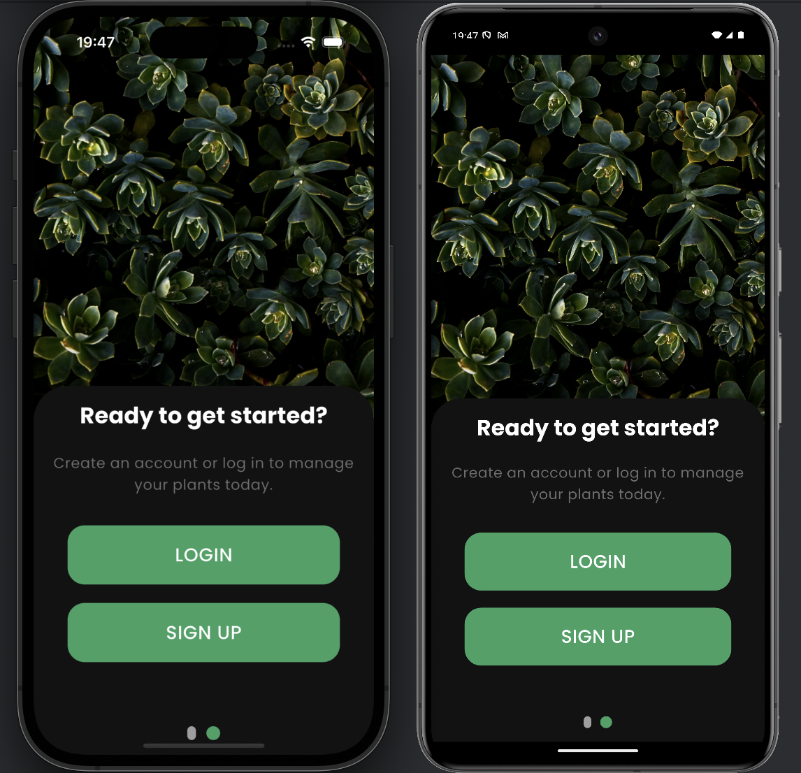
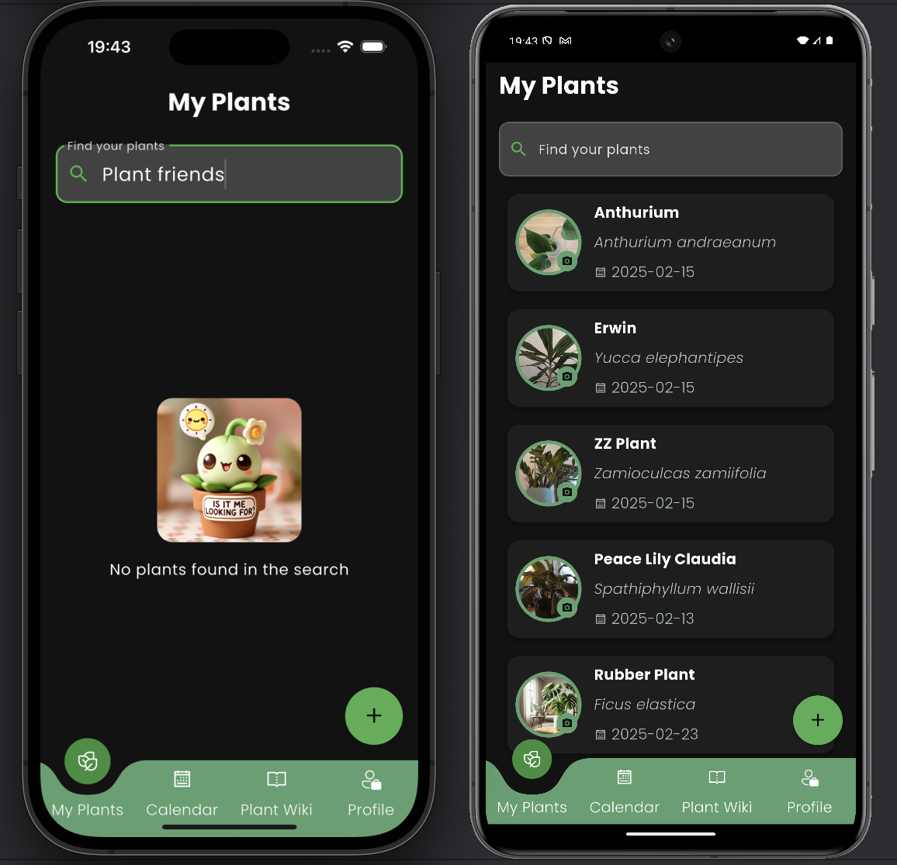
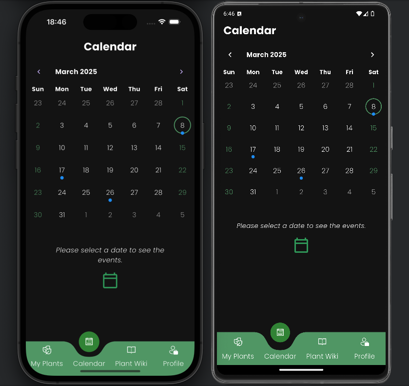

# 🌿 Plant Friends App by Group 4!

## Table of Contents
1. [Introduction](#introduction)
2. [Abstract](#-abstract)
3. [Features Overview](#-features-overview)
4. [Prerequisites](#prerequisites)
5. [Local Development](#local-development)
6. [Project Structure](#-project-structure)
7. [Dependencies Overview](#-dependencies-overview)
8. [Commands Overview](#-commands-overview)
9. [Testing](#-testing)
10. [Sample of Views](#-sample-of-views)
11. [Download PlantFriends on Google Play](#-download-plantfriends-on-google-play)


## Introduction
Members: Laura, Lisa, Gero, and Aylin

This repository contains a student project created for the ongoing course
on Software Engineering I & II using Flutter at HWR Berlin, spanning the winter term 2024 through 
the summer term 2025.

⚠️ This code is for educational purposes only. Please do not rely on it!


## 📖 Abstract

Plant Friends is a Flutter-based mobile app developed to help users manage their plants
and improve plant care. The app offers a user-friendly interface where users can add,
track, and receive reminders for their plants’ watering schedules.
It aims to simplify plant care for both beginners and experienced plant enthusiasts.
Additionally, the app features a plant wiki, plant suggestions via a quiz and a plant
recognition AI.
Throughout the development process, the group gained hands-on experience with Flutter,
Dart programming language, working with state management, and backend services (i.e. Firebase).


## 📱 Features Overview

The key features of the Plant Friends app include:

| Feature                         | Description                                                                                         |
|---------------------------------|-----------------------------------------------------------------------------------------------------|
| 🌿 Add Plant                    | Allows users to add a new plant by providing its name, scientific name, and photo.                  |
| ⏰ Plant Care Reminders          | Notifies users when their plants need watering.                                                     |
| 📚 Plant Wiki                   | Includes a library of popular houseplants with detailed care instructions.                          |
| 📅 Watering Log                 | Tracks watering history for each plant on Calendar Page.                                            |
| 👤 User Profiles                | Users can create profiles and sync their plant data across devices using Firebase.                  |
| 🔍 Search Plants                | Users can search their plant collection on My Plants Page and look for plants on Plant Wiki Page.   |
| ❤️ Plant Wishlist               | Allows users to save plants from Wiki page they want to add in Wishlist.                            |
| 📸 Photo Journal (Zoomable)     | Enables users to add plant photos and zoom in/out for detailed viewing within the photo journal.    |
| 🌱 Which plant suits me best?   | Asks questions about room conditions of user and recommends the best plants based on user answers.  |
| 🔍 Plant recognition AI         | Can identify plants from photos.                                                                    |
| 🗣️ Different language options  | Options: English, German, Turkish, Spanish, Italian, and French                                     |
| 📖️ App Tutorial                | Offers an app tutorial after first login.                                                           |
| 💡 Share Feedback               | Allows users to provide their thoughts and suggestions to improve this app.                         |
| 🌞🌚 Light and Dark Mode        | Offers both light and dark themes for a better user experience.                                     |
 

## Prerequisites

To run this project locally, ensure the following are installed:

1.	IDE of your choice (e.g., Android Studio or Visual Studio Code)
2.  Flutter SDK (installation guide: [https://docs.flutter.dev/get-started/install](https://docs.flutter.dev/get-started/install) )
3.	Git installed 
4.  Android Emulator through Android Studio (optional, only required if not using a physical Android device)
5.  Xcode Simulator for iOS (optional, only required if not using a physical iOS device)


## Local Development

This project uses Flutter as its framework. To build and run the app locally,
follow these steps:

1. Clone the repository:
    ```bash
    git clone https://github.com/GeroStoewe/plant_friends.git
    cd plant_friends
   ```

2. Fetch dependencies:
    ```bash
     flutter pub get
     ```

3. Run the app:
     ```bash
     flutter run
     ```


## 🏗️ Project Structure

The Plant Friends app follows a common Flutter project structure:

lib/
               
│── firebase/

│── fonts/

│── generated/

│── images/

│── l10n/

│── pages/

│── themes/

│── widgets/

│── main.dart


## 🛠️ Dependencies Overview

| Dependency                       | Description                                      | Why is it necessary?                                      |
|----------------------------------|--------------------------------------------------|-----------------------------------------------------------|
| 🔥 firebase_core                 | Integrates the Firebase SDK                      | Enables cloud data storage and authentication             |
| 🔐 firebase_auth                 | Allows user authentication                       | Enables users to sign in and sync data                    |
| 📦 cloud_firestore               | Cloud-based NoSQL database                       | Stores and syncs plant data in real-time                  |
| 📷 firebase_storage              | Enables cloud storage for media files            | Stores and retrieves plant photos from the cloud          |
| 🔄 firebase_database             | Real-time database service                       | Allows real-time syncing of structured data               |
| 🔑 google_sign_in                | Google authentication support                    | Enables sign-in with Google accounts                      |
| 🎨 line_awesome_flutter          | Icon library for Flutter                         | Provides stylish icons for UI                             |
| 💾 shared_preferences            | Persistent key-value storage                     | Saves user preferences locally                            |
| ⚙️ provider                      | State management solution                        | Manages app-wide state efficiently                        |
| 🌍 intl                          | Internationalization package                     | Supports date formatting and localization                 |
| 📅 table_calendar                | Calendar widget for Flutter                      | Displays and manages plant care schedules                 |
| 📷 image_picker                  | Select images from gallery or camera             | Allows users to upload plant photos                       |
| 🔐 permission_handler            | Handles app permissions                          | Manages permissions for accessing device features         |
| 🔗 http                          | HTTP client for Dart                             | Enables network requests for fetching data                |
| 📌 curved_labeled_navigation_bar | Navigation bar package                           | Provides a customizable bottom navigation bar             |
| 🎨 line_icons                    | Another icon library for Flutter                 | Enhances UI with additional icon styles                   |
| 📱 fluentui_system_icons         | Fluent UI icons from Microsoft                   | Provides modern and sleek UI icons                        |
| 🔔 firebase_messaging            | Firebase push notifications                      | Enables real-time notifications                           |
| 🔠 auto_size_text                | Auto-sizing text widget                          | Adjusts text size dynamically                             |


## 📝 Commands Overview

Since the app is built using Flutter, there are various commands you can run for development and debugging.
These commands are run via the terminal or your IDE’s terminal.

| Command                | Description                                                       |
|------------------------|-------------------------------------------------------------------|
| 🚀 `flutter run`       | Runs the app on a connected device or emulator                    |
| 🍏 `flutter build ios` | Builds the iOS release version (requires Xcode)                   |
| 🤖 `flutter build apk` | Builds the Android APK file                                       |
| 🧹 `flutter clean`     | Cleans the build folder to resolve any build issues               |
| 📦 `flutter pub get`   | Fetches the necessary dependencies                                |


## 🧪 Testing

Due to time constraints during the project development phase, comprehensive tests have not been
implemented in this app. We used exploratory testing to ensure the usability.


## 📸 Sample of Views

The following sample of views were taken from iOS (iPhone 15) and Android (Pixel 8) simulators.


* Welcome Page:
  <br/>
  <br/>
  


* Login & Signup:
  <br/>
  <br/>
  


* Sign up:
  <br/>
  <br/>
  


* Login:
  <br/>
  <br/>
  


* Login with Google Account:
  <br/>
  <br/>
  


* My Plants:
  <br/>
  <br/>
  


* Calendar:
  <br/>
  <br/>
  


* Plant-Wiki:
  <br/>
  <br/>
  


* Account:
  <br/>
  <br/>
  
 
  
## 📲🚀 Download PlantFriends on Google Play

PlantFriends is now available on Google Play! Get it now: (Play Store Link: [Click here](https://play.google.com/store/apps/details?id=com.hwr.plant_friends))


* Play Store:
  <br/>
  <br/>
  
